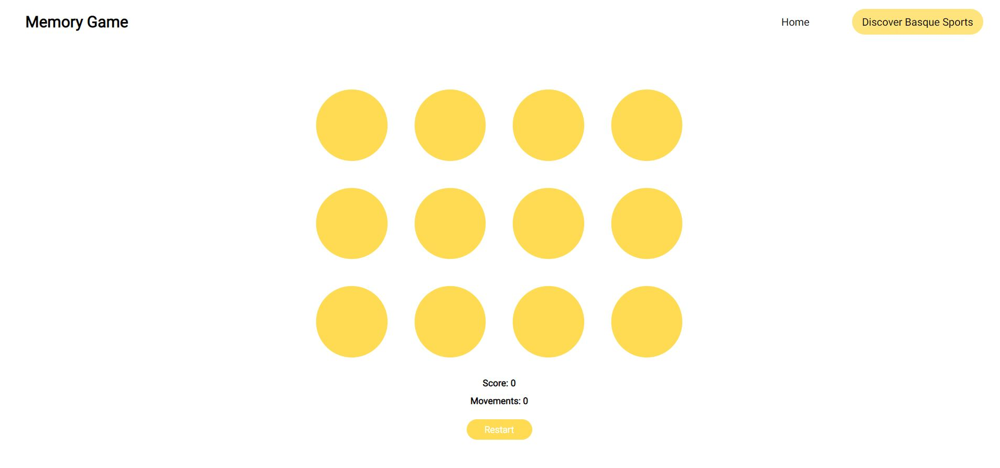
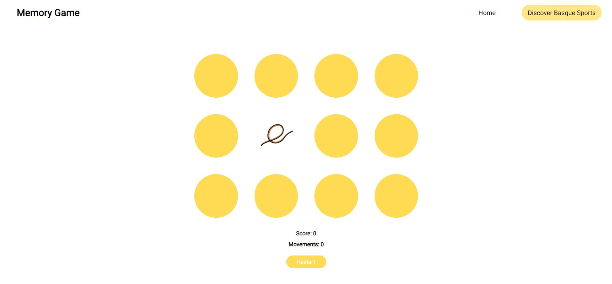
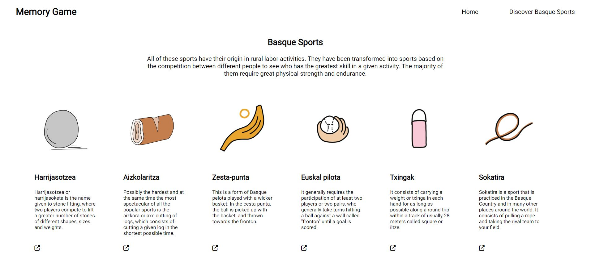

# Memory Game

## How It Works

Let's play! If you are not familiar with the game, the rules are very simple; flip over two cards at a time to find the matching ones. 

The game board consists of twelve cards arranged randomly in a grid. The deck is made up of six different pairs of cards, each with different illustrations on one side. 

Each turn:

* A player flips one card over to reveal its underlying illustration
* The player turns over a second card, trying to find the one that matches the same illustration
* If the cards match, that's one point for you and both cards will disappear from the game board
* If the cards do not match, both cards are returned to their initial hidden state

The game ends once all cards have been correctly matched.

You will find the score beneath the board, as well as the number of movements or flips.

If you want to restart the game, you can do so by clicking the Restart button.

## What I've learned

* To fully combine HTML5, CSS3 and Javascript into a project
* To work with empty arrays, as well as pushing and storing data in them
* To practice Advanced DOM (setAttribute, createElement, appendChild)
* To use inbuilt JavaScript functions such as Math.random and sort()
* To work with with loops
* To practice CSS transitions to improve the user's experience

## Personal insight

I noticed that the user was able to flip over more than 2 cards due to the time delay (`setTimeOut()`) in the match verification process. This resulted in  having some cards flipped over indefinitely, disrupting the logic of the game. 

In order to solve this bug, I have changed the event handler function associated with the click event, adding some verifications:

* If the user clicks twice the same card, nothing happens. It will not add up to the counter, the user will have to choose another card to continue playing

* If two cards have already been clicked, the user will have to wait until the match has been checked to continue playing

## Web Application

You will find below some images of each state of the application, as well as some additional information of each one:

*With:*
*- The game board*
*- A score result*
*- A movement counter*
*- A restart button*

Once you flip a card, an illustration will show up, your goal will be to find the matching card. The illustrations used in the project can be found in the link below:

Don't hesitate to check the Discover section, where you'll be able to learn about Basque traditional sports:

## Credits

* [learn-javascript-by-building-games](https://www.freecodecamp.org/news/learn-javascript-by-building-7-games-video-course/)

